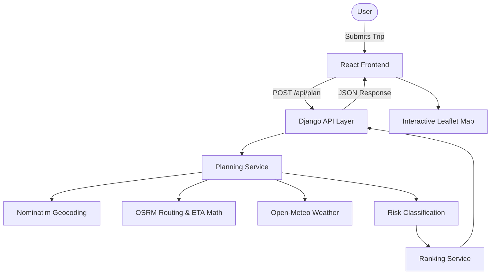

# Weather-Aware Truck Routing

A professional decision-support application that evaluates candidate truck routes using weather forecasts aligned with precise estimated arrival times at route checkpoints. It evaluates truck-load-sensitive weather risks, ranks alternative routes based on safety, and provides an interactive fleet-operations dashboard.

> **Disclaimer**: This is a decision-support demonstration and not a certified commercial truck-routing system or a guarantee of road safety. Severe weather and road closures must always be independently verified by drivers and dispatchers.

## Features
- **Route planning from origin to destination**: Generates multiple candidate routes.
- **Departure time and truck-load inputs**: Configurable trip parameters that affect risk assessment.
- **Weather-aware checkpoints**: Matches hourly forecasts to the truck's estimated arrival time at each checkpoint.
- **Wind, rain, and snow risk assessment**: Dynamically classifies risk based on load weight (e.g., restricting light trailers in high crosswinds).
- **Route comparison and explainable recommendations**: Ranks routes by safety and explains the recommendation logic.
- **Interactive map and forecast-hour heatmap**: Visualizes routes and scrubs through 48 hours of weather conditions.
- **Responsive fleet-operations dashboard**: A modern, readable UI built for dispatch and operations teams.

## Table of Contents
- [Problem Statement and Objectives](#problem-statement-and-objectives)
- [Screenshots and Demo](#screenshots-and-demo)
- [Feature Details](#feature-details)
- [System Architecture](#system-architecture)
- [End-to-End Data Flow](#end-to-end-data-flow)
- [Routing Methodology](#routing-methodology)
- [Weather Data and Forecast Alignment](#weather-data-and-forecast-alignment)
- [Risk Assessment Rules](#risk-assessment-rules)
- [Route Recommendation Algorithm](#route-recommendation-algorithm)
- [Interactive Map and Forecast Slider](#interactive-map-and-forecast-slider)
- [API Reference](#api-reference)
- [Technology Stack](#technology-stack)
- [Local Development Setup](#local-development-setup)
- [Environment Variables and Configuration](#environment-variables-and-configuration)
- [Testing and Quality Assurance](#testing-and-quality-assurance)
- [Deployment Guide: Render and Vercel](#deployment-guide-render-and-vercel)
- [Security, Reliability, and Limitations](#security-reliability-and-limitations)
- [Engineering Decisions and Trade-offs](#engineering-decisions-and-trade-offs)
- [Known Limitations and Future Roadmap](#known-limitations-and-future-roadmap)
- [Contributing and Project Maintenance](#contributing-and-project-maintenance)
- [Author and Project Links](#author-and-project-links)

---

## Problem Statement and Objectives
**Problem:** A route that is shortest by distance or time may encounter severe, dangerous weather. Traditional routing systems often fail to align weather forecasts with the truck's estimated time of arrival (ETA) at various points along the corridor, leading dispatchers to route trucks into developing storms.

**Objectives:**
This project evaluates candidate routes using weather forecasts dynamically aligned with estimated arrival times at checkpoints. The goal is to maximize safety by minimizing exposure to No Travel, Severe, and High weather risks, while factoring in the physical susceptibility of the truck load to crosswinds.

*Implemented Behavior:* The system actively identifies and deprioritizes routes intersecting No-Travel weather boundaries.
*Future Improvements:* Incorporating live traffic, commercial truck height/weight bridges, and automated Hours of Service (HOS) breaks into the ETA calculation.

---

## Screenshots and Demo
**Live Demo:** *(Deployment pending)*

*   **Trip planning form & Route alternatives:** Shows the compact input form and ranked route cards, highlighting the recommended choice and safety badges. 
*   **Checkpoint risk visualization:** Hovering over an interactive map checkpoint reveals the ETA, hourly forecast matched to that time, and calculated risk level. 
*   **Forecast slider and heatmap:** Dragging the slider from +0h to +48h repaints the heat map across the corridor, revealing how storms travel geographically over time.

---

## Feature Details
*   **Trip Form**: 
    *   *What it does:* Accepts planning parameters. 
    *   *Inputs:* Origin, destination, departure time, load weight (lbs), and checkpoint interval (10/25/50 miles). 
    *   *Outputs:* Form validation and an API request. Fits into the workflow as the primary dispatcher interface.
*   **Safety Recommendation Engine**: 
    *   *What it does:* Analyzes all generated routes and flags the safest option. 
    *   *Inputs:* Aggregated risk-miles per route.
    *   *Outputs:* A lexicographically ranked list of routes with an explanation of why the best route won.
*   **Time-Scrubber Heatmap**: 
    *   *What it does:* Animates the predicted weather risk by displaying a 48-hour window within the available 16-day forecast.
    *   *Inputs:* Pre-calculated risk levels for hours 0-48 relative to departure.
    *   *Outputs:* An instant `leaflet.heat` visual update, allowing dispatchers to decide whether to delay a trip.

---

## System Architecture
The application uses a decoupled architecture. The React frontend handles UI state and mapping, while the Django backend operates as a modular, stateless planning API.



### Directory Tree
```
├── backend/
│   ├── api/               # HTTP views, validation logic (views.py, tests)
│   ├── config/            # Django settings, urls, wsgi
│   ├── planning/          # High-level orchestration (service.py)
│   ├── recommendations/   # Pure Python ranking and explanations
│   ├── risk/              # Pure Python thresholds, rules, mile aggregation
│   ├── routing/           # Geometry, checkpoint sampling, ETA math, OSRM/Nominatim providers
│   ├── weather/           # Open-Meteo integration and caching
│   ├── build.sh           # Render deployment script
│   └── requirements.txt   # Python dependencies
├── frontend/
│   ├── src/
│   │   ├── features/      # RouteCards, RouteResults, TripForm
│   │   ├── hooks/         # React queries (usePlanTrip.js)
│   │   ├── services/      # planningApi.js fetching
│   │   ├── App.jsx        # Main application layout and Map
│   │   └── index.css      # Dashboard styling and responsive layout
│   ├── vercel.json        # Vercel SPA routing
│   └── package.json       # Node dependencies
├── loom_outline.md        # Walkthrough script
└── README.md              # Documentation
```

---

## End-to-End Data Flow
1. User submits origin, destination, departure time, load weight, and checkpoint interval.
2. Frontend validates the form and submits a JSON request to `POST /api/plan`.
3. Django validates the payload boundaries (e.g., departure within 14 days).
4. `routing.providers.nominatim` resolves place names to geographic coordinates.
5. `routing.providers.osrm` retrieves candidate routes using `alternatives=true`. (If <3 routes exist, synthetic via-point detours are generated mathematically and resolved).
6. The system samples coordinates along the route geometry at the requested 10/25/50-mile interval.
7. Estimated arrival times (ETA) are calculated for every checkpoint using distance interpolation.
8. `weather.providers.open_meteo` retrieves 16-day hourly forecasts for all checkpoints in batched chunks.
9. Forecasts are aligned to the specific hour nearest to the truck's ETA at that checkpoint. Weather units are normalized (mph, inches/hr).
10. `risk.classifier` applies base weather thresholds and load-based overrides to generate a risk level (0-4).
11. `risk.aggregation` calculates risk miles, assuming each checkpoint "owns" half the distance to its neighbors.
12. `recommendations.ranking` lexicographically ranks the routes to find the safest option.
13. The frontend receives the response and renders the dashboard cards, map geometries, and heatmap layer.

---

## Routing Methodology
*   **Provider**: Public OSRM API.
*   **Alternatives**: Requests use `alternatives=true`. If OSRM returns fewer than 3 distinct routes, the backend mathematically calculates perpendicular via-points (100 miles out, 30 miles laterally) to force OSRM to generate detours. Duplicate geometries are filtered out. Detours >1.5× the fastest time are dropped.
*   **Checkpoints**: Coordinates are extracted by walking the route geometry linestring and interpolating exact coordinates at the requested mileage interval (e.g., every 25 miles).
*   **ETAs**: Computed via distance proportion `(mile / total_distance) * total_duration`. 
*   **Duration Adjustment**: OSRM returns car speeds. The backend multiplies duration by `TRUCK_TIME_FACTOR` (default `1.1`) to approximate slower truck travel.

> **WARNING:** The public OSRM provider uses a *car profile*. It does **not** enforce truck-specific height, weight, hazardous-material, or bridge restrictions. The ETAs do not account for traffic or mandatory HOS rest breaks.

---

## Weather Data and Forecast Alignment
*   **Provider**: Open-Meteo Hourly API.
*   **Variables**: Wind speed (10m), rain, showers, and snowfall.
*   **Batching & Caching**: Checkpoints are batched in groups of 50 per HTTP request using a ThreadPoolExecutor. Responses are cached locally in memory for 15 minutes to prevent rate-limiting and accelerate identical subsequent queries.
*   **Alignment**: The backend converts the checkpoint's ETA to the nearest whole hour and slices that specific hour out of the 16-day forecast array.
*   **Missing Data**: If Open-Meteo returns `null` or missing data for a variable at a specific hour, the code coerces it to `0`. **Note:** This is a critical known limitation. In a production environment, the system should mark the checkpoint as Unknown, flag it for verification, and avoid presenting it as confirmed safe. Currently, missing weather is incorrectly treated as safe (Level 0).

---

## Risk Assessment Rules
Risk levels are evaluated sequentially. Wind thresholds use inclusive lower bounds (e.g., exactly 35 mph is High). Rain and snow thresholds use inclusive upper bounds (e.g., exactly 0.25 in/hr rain is Moderate, not High).

**Base Thresholds:**
| Level (Int) | Label | Wind (mph) | Rain (in/hr) | Snow (in/hr) |
| :--- | :--- | :--- | :--- | :--- |
| 0 | Low | < 25 | < 0.10 | < 0.5 |
| 1 | Moderate | 25 to < 35 | 0.10 to 0.25 | 0.5 to 1.0 |
| 2 | High | 35 to < 45 | > 0.25 to 0.50 | > 1.0 to 2.0 |
| 3 | Severe | 45 to < 55 | > 0.50 to 1.00 | > 2.0 to 3.0 |
| 4 | No Travel | ≥ 55 | > 1.00 | > 3.0 |

**Load-Based Overrides:**
After calculating the base risk from the worst weather factor, the system applies truck-load overrides:
*   If `wind >= 55 mph`: **No Travel** (regardless of load).
*   If `45 <= wind < 55 mph` AND `load > 30,000 lbs`: Elevated to **No Travel**.
*   If `35 <= wind < 45 mph` AND `load > 40,000 lbs` AND base level < 3: Elevated to **Severe**.

*Risk Classification vs Mileage Summaries*: Classification applies to a specific coordinate at its estimated arrival time. Mileage summaries aggregate the geographic distance the truck spends in that classification.

---

## Route Recommendation Algorithm
Candidate routes are ranked lexicographically (lower is better) using a pure, deterministic Python algorithm:
1.  **Feasibility**: Boolean flag (`no_travel_mi > 0`). Routes with any No-Travel conditions fall to the bottom.
2.  **Major Danger**: Sum of `severe_mi` + `no_travel_mi`. Minimizes life-threatening conditions.
3.  **High Danger**: Sum of `high_mi`.
4.  **Average Risk**: Mileage-weighted average risk level across the entire route.
5.  **Time**: Shortest travel time `duration_h`.

**Example:**
*   *Route A*: 10 hrs travel, 0 Severe mi, 50 High mi.
*   *Route B*: 9 hrs travel, 10 Severe mi, 0 High mi.
*   **Result**: Route A is recommended. Even though it takes an hour longer, it completely avoids the 10 Severe miles present on Route B. Travel time is only used as a final tie-breaker if safety profiles are identical.

---

## Interactive Map and Forecast Slider
*   **Map Rendering**: Routes are drawn as Leaflet Polylines. The selected route is highlighted in its assigned color (Blue, Cyan, or Magenta) and brought to the front; unselected routes become translucent.
*   **Checkpoints**: Rendered as colored circles corresponding to their risk level. Clicking reveals the tooltip.
*   **Forecast Slider**: A 0–48 hour scrubber at the bottom left. 
*   **Performance Optimization**: The backend pre-calculates the risk level for *every hour* from departure to +48h for *every checkpoint* and sends it in a `heat` array. Dragging the slider does **not** trigger new API requests. It merely extracts the requested hour's index from the pre-calculated array and calls `leaflet.heat`'s `setLatLngs()`, resulting in instant local rendering.
*   *Note*: The heatmap represents *forecast weather risks*, not real-time certified road closures.

---

## API Reference
### `POST /api/plan`
**Purpose**: Orchestrates geocoding, routing, weather fetching, risk assessment, and route ranking.
**Content-Type**: `application/json`

**Request JSON Schema:**
| Field | Type | Required | Description | Constraints |
| :--- | :--- | :--- | :--- | :--- |
| `origin` | string | Yes | Start location name or lat,lng | - |
| `destination` | string | Yes | End location name or lat,lng | - |
| `departure` | ISO string | Yes | Estimated departure time | Max +14 days from now |
| `load_lb` | number | Yes | Total load weight in pounds | 0 to 100,000 |
| `interval_mi` | number | Optional | Checkpoint distance | 10, 25, or 50 (default 25) |

**Example Request:**
```json
{
  "origin": "Chicago, IL",
  "destination": "Denver, CO",
  "departure": "2026-10-15T14:00:00Z",
  "load_lb": 45000,
  "interval_mi": 50
}
```

**Example Response:** *(Omitted bulk geometry/checkpoint arrays for brevity)*
```json
{
  "origin": {"lat": 41.8781, "lng": -87.6298},
  "destination": {"lat": 39.7392, "lng": -104.9903},
  "recommended": 0,
  "explanation": ["0 Severe+ mi", "25.0 High mi", "avg risk 0.8", "15.4 h travel"],
  "routes": [
    {
      "id": 0,
      "rank": 1,
      "summary": {
        "no_travel_mi": 0.0,
        "severe_mi": 0.0,
        "high_mi": 25.0,
        "avg_risk": 0.8,
        "duration_h": 15.4,
        "distance_mi": 1002.5,
        "eta": "2026-10-16T05:24:00+00:00"
      },
      "geometry": [[41.8781, -87.6298], ...],
      "checkpoints": [
        {
          "mile": 0.0, "lat": 41.8781, "lng": -87.6298,
          "eta": "2026-10-15T14:00:00+00:00",
          "level": 0, "label": "Low", "reason": "wind Low",
          "wind_mph": 12.0, "rain_in_hr": 0.0, "snow_in_hr": 0.0,
          "heat": [0, 0, 1, 2, 0, ...]
        }
      ]
    }
  ]
}
```
**Error Codes**: `400 Bad Request` (Validation failed), `502 Bad Gateway` (Upstream OSRM/Open-Meteo failure).

---

## Technology Stack
**Frontend:**
*   `React` & `Vite`: Fast, modern SPA development.
*   `react-leaflet` & `leaflet.heat`: Lightweight, performant canvas-based interactive maps and heatmaps.
*   `Vanilla CSS`: Clean, customized logistics dashboard styling without framework bloat.

**Backend:**
*   `Django`: Stateless API request handling, validation, and security middleware.
*   `Python 3`: Pure, fast, unit-testable implementation of complex business/risk rules.
*   `gunicorn` & `whitenoise`: Production-grade WSGI server and static handling.
*   `django-cors-headers`: For strict cross-origin frontend protection.

**External Services:**
*   `OSRM` & `Nominatim`: Open-source, free routing and geocoding.
*   `Open-Meteo`: Free, fast, batched hourly weather forecasts.

---

## Local Development Setup
**Prerequisites:** Python 3.10+, Node.js 18+

```powershell
# 1. Clone the repository
git clone https://github.com/hd84339/Truck-Routing.git
cd Truck-Routing

# 2. Start the Backend
cd backend
python -m venv venv
.\venv\Scripts\activate      # macOS/Linux: source venv/bin/activate
pip install -r requirements.txt
python manage.py runserver

# 3. Start the Frontend (in a new terminal)
cd frontend
npm install
npm run dev
```
Open `http://localhost:5173`. The Vite proxy automatically routes `/api` calls to Django at `localhost:8000`.

---

## Environment Variables and Configuration
| Variable | Purpose | Required | Example Value | Used By |
| :--- | :--- | :--- | :--- | :--- |
| `DEBUG` | Disables verbose errors in production | No | `False` | Django `settings.py` |
| `DJANGO_SECRET_KEY` | Cryptographic signing key | No (defaults unsafe) | `django-insecure-xyz...` | Django `settings.py` |
| `ALLOWED_HOSTS` | Whitelists allowed server domains | No | `api.example.com` | Django `settings.py` |
| `CORS_ALLOWED_ORIGINS` | Whitelists frontend domains | No | `https://truck.vercel.app` | Django `settings.py` |
| `TRUCK_TIME_FACTOR` | Multiplier for car-to-truck ETAs | No | `1.1` | Django `settings.py` |
| `VITE_API_URL` | Base URL for the deployed backend | No | `https://api.example.com` | Vite `planningApi.js` |

*Note:* `VITE_` variables are public to the browser. Do not store secrets in them.

---

## Testing and Quality Assurance
The codebase includes comprehensive unit and integration tests for core logic.

```bash
# From the backend directory:
python manage.py test
```
**Test Coverage:**
*   `api.tests.test_plan_api`: End-to-end integration and API contract verification.
*   `api.tests.test_validation`: Rejects past dates, invalid intervals, out-of-bounds weights.
*   `routing.tests.test_eta`: Haversine math, exact mile sampling, and timezone alignment.
*   `risk.tests.test_thresholds` & `test_load_rules`: Verifies edge-case behavior of strict weather thresholds and load overrides.
*   `risk.tests.test_segment_miles`: Verifies half-distance midpoint aggregation logic.
*   `recommendations.tests.test_ranking`: Verifies lexicographical sorting prioritizes life safety over travel time.

```bash
# Production Readiness Checks
python manage.py check --deploy
cd ../frontend && npm run build
```

---

## Deployment Guide: Render and Vercel
The system is configured for seamless deployment on Vercel (Frontend) and Render (Backend).

### 1. Deploy the Backend (Render)
1. Create a new **Web Service** on Render, connected to your GitHub repo.
2. **Root Directory**: `backend`
3. **Environment**: Python
4. **Build Command**: `./build.sh`
5. **Start Command**: `gunicorn config.wsgi --bind 0.0.0.0:$PORT`
6. Add Environment Variables: `DEBUG=False`, `DJANGO_SECRET_KEY=<secure-random-string>`, `ALLOWED_HOSTS=<your-render-url>.onrender.com`.

### 2. Deploy the Frontend (Vercel)
1. Create a new project on Vercel.
2. **Root Directory**: `frontend`
3. **Framework Preset**: Vite
4. **Environment Variables**: Add `VITE_API_URL=https://<your-render-url>.onrender.com`.
5. Deploy. Vercel automatically utilizes the `vercel.json` for SPA routing fallback.

### 3. Finalize CORS
Return to your Render backend dashboard and add `CORS_ALLOWED_ORIGINS=https://<your-vercel-url>.vercel.app`. Without this, browser security will block frontend API requests.

---

## Security, Reliability, and Limitations
*   **Stateless Security**: The backend utilizes no database, maintaining a highly secure, stateless footprint. 
*   **CORS**: Strict Origin validation prevents unauthorized web clients from abusing the API.
*   **Missing Weather Safety**: If the Open-Meteo provider returns missing arrays or drops connections, the system currently treats missing weather as a value of `0` (Safe). *Users must independently verify conditions.*
*   **Rate Limits**: The public OSRM and Nominatim endpoints impose strict rate limits. A commercial application must replace these with API-keyed equivalents (e.g., Mapbox, HERE).

---

## Engineering Decisions and Trade-offs
*   **Modular Monolith**: The backend avoids microservices in favor of strict domain boundaries (`api/`, `planning/`, `risk/`, `routing/`). This ensures unit tests are blistering fast while remaining easy to deploy as a single container.
*   **Pure Python Risk Engine**: The entire `risk` and `recommendations` modules have zero dependencies on Django or external network calls. This allows exhaustive testing of complex permutation rules.
*   **Pre-computed Heatmap**: By calculating the entire 48-hour matrix in a single backend pass, the frontend heatmap slider operates entirely on local browser memory at 60fps, avoiding expensive round-trip API network requests on every drag.

---

## Known Limitations and Future Roadmap
**Current Limitations:**
*   OSRM car routing violates truck bridge clearances, weight limits, and hazardous material bans.
*   ETAs assume constant non-stop driving.
*   Public provider rate limits.
*   Missing forecast values default to zero/safe.

**Potential Next Improvements:**
*   Swap `routing.providers` for a commercial truck-routing API (e.g., HERE Technologies).
*   Incorporate automated FMCSA Hours-of-Service (HOS) rest stops into the ETA timeline.
*   Support live traffic conditions.
*   Enhance weather uncertainty handling (e.g., probabilistic risk levels).

---

## Contributing and Project Maintenance
To contribute:
1. Ensure strict separation of domains (e.g., do not place HTTP parsing inside `risk/rules.py`).
2. Run `python -m unittest discover -s . -p "test_*.py"` before submitting any pull requests.
3. If adjusting risk thresholds, ensure matching test coverage is added in `risk/tests/`.

*License:* The repository currently has no explicit license file. Please contact the author regarding reuse permissions.

---

## Author and Project Links
*   **Repository**: [https://github.com/hd84339/Truck-Routing](https://github.com/hd84339/Truck-Routing)
*   **Demo**: *(Deployment pending)*
